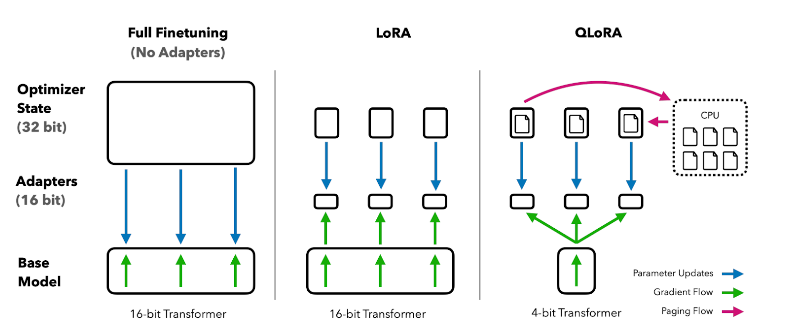
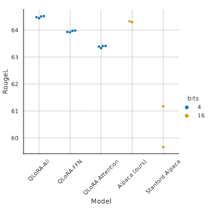
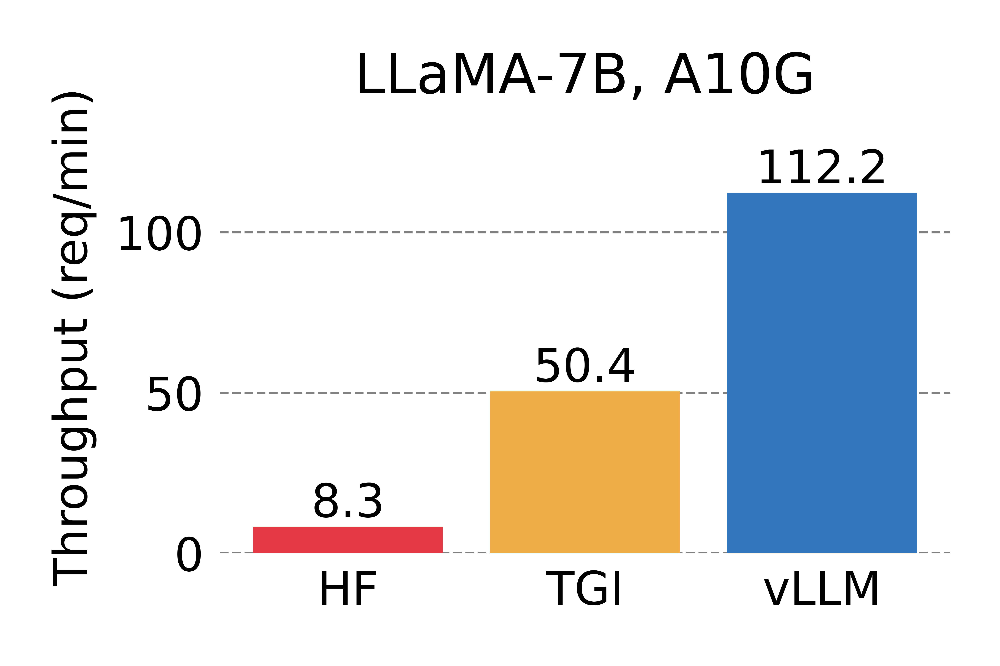
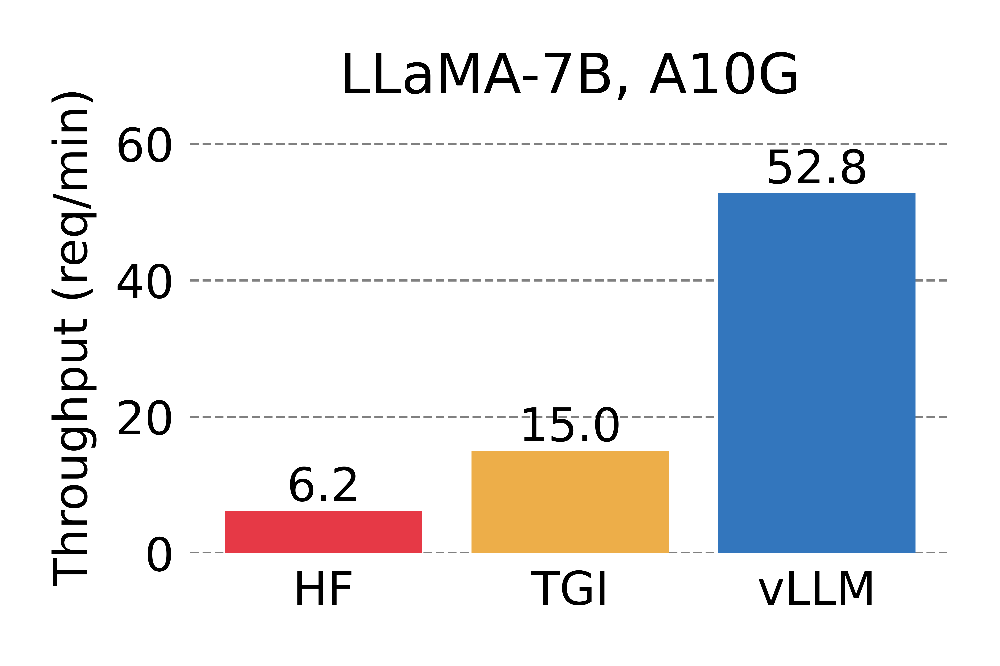

Pre-trained language models are trained on a corpus of general-domain text, enabling them to capture the nuanced features of the language across various layers. This process, often referred to as self-supervised learning, a variant of machine learning where the data provides the supervision, allows the model to learn a wide array of linguistic patterns, ranging from basic syntax to more complex semantic structures [1]. The advantage of this approach is twofold. Firstly, it allows the model to develop a comprehensive understanding of the language, thereby enhancing its ability to generate human-like text. Secondly, it provides a robust foundation upon which the model can be fine-tuned for specific tasks, thereby increasing the versatility and applicability of the model in diverse contexts.

Our primary work in this project involves fine-tuning the pre-trained language model on target task data to tailor it to our specific use case. This process of adaptation can be achieved through two primary methodologies: Supervised Fine-tuning and Reinforcement Learning with Human Feedback (RLHF).

Supervised Fine-tuning involves training the model on a labeled dataset specific to the target task. This allows the model to adjust its parameters and learn the specific features of the task, thereby enhancing its performance on the target task.

On the other hand, Reinforcement Learning with Human Feedback (RLHF) involves training the model based on feedback from human evaluators. The model generates outputs, human evaluators rank these outputs based on quality, and the model is then updated to favor higher-ranked outputs. This method allows the model to learn from human judgment, thereby improving its ability to generate outputs that align with human expectations and preferences.

These methodologies, individually or in combination, provide a robust framework for adapting the pre-trained language model to our specific use case.

The issue of model size and resource availability presents a significant challenge in the deployment of large language models like Llama 2. With the model size reaching upwards of 14GB, it demands substantial computational resources for both loading and fine-tuning the model. For instance, a GPU such as the T4, with its 16GB of VRAM, could barely accommodate the model, let alone be used for its fine-tuning.

This is where Quantization comes in. Quantization is a technique used to reduce the computational and memory demands of machine learning models without significantly sacrificing their performance. It involves reducing the precision of the numerical values that the model uses to represent the learned features of the data. For instance, a model might be trained using 32-bit floating-point numbers, but with quantization, these can be reduced to lower-precision representations, such as 16-bit integers or even lower.

Studies have demonstrated that the application of QLORA 4-bit quantization technique to Llama models yields promising results. This approach, which reduces the precision of the numerical values used by the model to a mere 4 bits, has been shown to maintain the model's performance while significantly. Even with this drastic reduction in numerical precision, Llama models have been able to achieve state-of-the-art performances on various benchmarks [2].

Traditional fine-tuning methodologies for pre-trained language models (PLMs) necessitate the updating of all the model's parameters. This process, while comprehensive, is computationally intensive and demands substantial volumes of data, posing significant challenges in terms of resource utilization and efficiency.

In contrast, Parameter-Efficient Fine-Tuning (PEFT) offers a more resource-conscious alternative. This approach operates by updating only a small subset of the model's parameters. The primary advantage of this method is its efficiency, as it significantly reduces the computational resources and data required for fine-tuning.

The importance of experiment tracking cannot be overstated in the context of evaluating various fine-tuning methods such as LoRA and QLoRA. This process is instrumental in ensuring reproducibility, maintaining a structured version history, facilitating collaboration, and aiding in the identification of optimal training configurations. Given the multitude of iterations, hyperparameters, and model versions involved in the fine-tuning process, tools like Weights & Biases (W&B) become indispensable.

W&B offers a comprehensive platform for experiment tracking, providing a dashboard that allows for the visualization of metrics, comparison of runs, and management of model checkpoints. Its seamless integration with multiple frameworks enhances its utility and ease of use. Often, the realization of these benefits is as simple as adding a single argument to your training script, as will be demonstrated in the Hugging Face PEFT LoRA section.

The selection of target task data represents a critical aspect of the fine-tuning process, as the performance of the fine-tuned model is heavily contingent upon it. This selection process, however, poses a significant challenge, particularly given the multimodal nature of web content, which encompasses not only text but also multimedia elements such as images, audio, and video.

To address this challenge, we propose the utilization of multiple datasets, potentially necessitating some degree of customization to align with our specific use case. The cnn_dailymail dataset, for instance, is a widely recognized dataset employed for summarization tasks. Other notable datasets include the OpenOrca dataset and the relatively new Guanaco dataset. The samsum_dataset contains about 16k messenger-like conversations with summaries.

In the realm of language models, such as those provided by HuggingFace, raw text does not serve as the direct input to the model. Instead, the text must undergo a transformation process to convert it into a format that the model can interpret. This transformation process, known as tokenization, serves as the conduit between the textual data and the model. It translates the text into a sequence of integers, with each integer representing a specific word, subword, or character.

When leveraging a pre-trained model, it is imperative to tokenize the input data in the exact manner as was done during the model's training. Any deviation from this could result in the model misinterpreting the input. Consequently, it is standard practice to employ the tokenizer that accompanies the model. This ensures congruence between the tokenization employed during inference or fine-tuning and that used during the original training. This practice underscores the pivotal role of tokenization in the effective utilization of pre-trained language models.

The datasets we are working with contain vast amounts of data. Given the limited resources at our disposal, it is crucial to manage this data effectively to prevent overwhelming the system and potentially causing crashes.

Moreover, the data samples within these datasets may vary in length, particularly in tasks related to text processing. This variability can lead to inconsistencies that the model may find challenging to handle. Therefore, it is essential to implement strategies that can manage these inconsistencies and facilitate efficient processing of the data by the model.

This is where batching comes in. Batching involves grouping data into smaller subsets or 'batches', and feeding these batches to the model one at a time [8]. This approach significantly reduces the computational load, making the training process more manageable and efficient.

Batching strategies form a crucial aspect of the training process for language models, with Llama-recipes supporting two such strategies. The default strategy is packing, which concatenates the tokenized samples into long sequences that fill up the context length of the model. This strategy is computationally efficient as it avoids any padding and ensures all sequences have the same length. However, samples at the boundary of the context length are truncated, with the remainder of the cut sequence used as the start of the next long sequence.

While packing is efficient, it may introduce noise into the training data when the amount of training data is small, potentially impacting the prediction performance of the fine-tuned model. To mitigate this, Llama-recipes also supports a padding strategy. This strategy does not introduce additional noise due to truncated sequences. It aims to minimize efficiency loss by batching samples of similar length together, thereby necessitating minimal padding.

Padding is a technique used to extend inputs that are shorter than the model's expected length. This is particularly important for transformer-based models, which require fixed-sized batch inputs. Padding ensures consistent tensor dimensions across different inputs, facilitating efficient and error-free processing by the model.

In Natural Language Processing (NLP) tasks, various tokens such as start-of-sequence (sos), end-of-sequence (eos), and padding tokens are used. A common approach is to use the eos token as the padding token. However, this can lead to complications, as the model may learn to treat the eos token as filler and not generate it as part of its output.

To avoid this, a custom padding token () is introduced. The model recognizes this token as padding, ensuring it does not interfere with the model's output generation.

Finally, the direction of padding must be specified. In this context, padding is added to the right. This is crucial, as certain training configurations, especially with mixed precision (fp16), can cause crashes with left-side padding.

Language models, while powerful, often require additional context and task-specific information to generate accurate and relevant results. Without this context, the model may struggle to understand the nature of the task at hand, leading to outputs that may not align with the desired results. This challenge is particularly pronounced in the context of Llama 2, where the context size, in terms of the number of tokens, has been expanded from 2048 to 4096, increasing the complexity of the task.

Prompt engineering is a technique used in Natural Language Processing (NLP) to enhance the performance of language models. It involves creating prompts, which are concise pieces of text that provide additional context or guidance to the model. These prompts could include information about the topic or genre of the text the model is expected to generate.

Creating effective prompts for language models involves several key steps. Prompts should be clear and concise to provide unambiguous guidance and prevent confusion. Including specific examples can help the model better understand the task. It's important to verify prompts to ensure they guide the model correctly, which may involve review or initial testing. Continual testing and refinement of prompts based on their performance is necessary, and any prompt not leading to satisfactory results should be adjusted. Lastly, feedback from human evaluators or automated systems is invaluable for refining prompts and improving their effectiveness.

Role-based prompting is a technique in Natural Language Processing (NLP) that enhances the performance of language models by providing them with a specific role or perspective. This approach can lead to more relevant and engaging responses, as it helps the model understand the context better, thereby increasing accuracy. However, it requires more effort to gather and provide the necessary information about the role or perspective. For instance, if the model is given the role of a climate change activist at a climate conference, the prompt would guide the model to describe the current scenario in a way that aligns with the role.

Example:

"You are a climate change activist giving a speech to leaders of pollution-inducing industries. Discuss the impact of their industries on the environment, provide evidence of the damage caused, suggest sustainable alternatives they could consider, and appeal to their responsibility towards future generations."

The Chain of Thought Technique is another prompting strategy that involves presenting the language model with a sequence of prompts or questions, designed to guide its thought process and facilitate the generation of a more coherent and relevant response. By structuring the model's thought process in a logical and sequential manner, this technique can aid in producing more thoughtful and well-reasoned responses, thereby enhancing the overall performance of the language model. It improves coherence by guiding the language model through a problem or question in a structured way, leading to more relevant responses. It also increases depth, as a series of prompts allows the model to explore a topic more thoroughly, potentially yielding more insightful responses. However, this technique requires significant effort to create and provide the necessary prompts or questions.

Let us consider our example of a climate change activist at a climate conference again but this time using the Chain of Thought Technique.

Example:

You are a climate change activist speaking at a climate conference. Address the audience about the urgent need for action. Begin with:

1. The current state of the global climate and the scientific consensus.
2. Discuss the major contributors to climate change.
3. Highlight the consequences of inaction.
4. Propose sustainable practices and policies that can mitigate these effects.
5. End with a call to action, urging the audience to take immediate steps towards sustainability. To engage the audience, include 1 or 2 anecdotes or stories that highlight the human impact of climate change.

The training of Large Language Models (LLMs) involves processing vast amounts of data, often proprietary, on a large scale. Coupled with the inherent opacity of LLM parameters, this makes it challenging to explain their behavior when responding to user queries, particularly in terms of bias and robustness. A significant challenge posed by LLM behavior is "hallucination," a phenomenon where LLMs present incorrect or inappropriate information as fact. [3] Hallucinations in language models occur when they generate responses to queries about unfamiliar topics, specific perspectives, or particular tones or styles. The model may create information or facts that are inaccurate, unsupported, inconsistent with the desired perspective, or not in line with the required tone or style. To address these issues, we can provide more context or information about the topic for accurate responses. If a specific perspective is required, giving additional information about the desired viewpoint would help. For a specific tone or style, details about the desired tone or audience can be provided.

Inference, the process of generating responses for a given prompt, presents a significant challenge in the performance of Large Language Models (LLMs). The bottleneck in LLM serving is often memory. During the autoregressive decoding process, all input tokens to the LLM produce their attention key and value tensors. These tensors are stored in GPU memory to generate subsequent tokens. This stored data, often referred to as KV (Key-Value) cache, can consume substantial memory resources, potentially impacting the performance and efficiency of the LLM. It can take up to 1.7GB for a single sequence in models like LLaMA-13B. The size of the KV cache depends on the sequence length, which can be highly variable and unpredictable. Consequently, managing the KV cache efficiently is a substantial challenge. Existing systems often waste 60% to 80% of memory due to fragmentation and over-reservation, highlighting the need for improved memory management strategies in LLMs.

PagedAttention is an attention algorithm designed to address the memory management challenges in Large Language Models (LLMs) [4]. Drawing inspiration from the concept of virtual memory and paging in operating systems, PagedAttention allows for the storage of continuous keys and values in non-contiguous memory space. It achieves this by partitioning the Key-Value (KV) cache of each sequence into blocks, with each block containing the keys and values for a fixed number of tokens. During the attention computation process, the PagedAttention kernel efficiently identifies and fetches these blocks. This approach offers a more efficient way to manage memory in LLMs, reducing fragmentation and over-reservation. PagedAttention manages keys and values in a flexible way, similar to how virtual memory operates in an OS. It views blocks as pages, tokens as bytes, and sequences as processes. The logical blocks of a sequence, which are contiguous, are mapped to non-contiguous physical blocks via a block table. While generating new tokens, the allocation of physical blocks is carried out in response to demand. This approach allows for efficient memory management even when blocks are not contiguous in memory. In PagedAttention, memory waste is confined to the last block of a sequence, leading to near-optimal memory usage with waste under 4%. This efficiency allows for batching more sequences together, increasing GPU utilization, and significantly boosting throughput, demonstrating the practical benefits of this approach in Large Language Model (LLM) systems.

Performance measurement is crucial for improvisation in model development. It involves two primary techniques: Quantitative and Qualitative techniques. Quantitative techniques in performance measurement aim to collect objective metrics that can be easily compared during and after each model fine-tuning run. These metrics provide immediate feedback on the model's performance. The primary metrics collected typically include loss and perplexity. Loss measures the discrepancy between the model's predictions and the actual data, while perplexity evaluates how well the model predicts a sample and is commonly used in language modeling. K-Fold Cross-Validation is a technique used to assess the performance of a model and enhance its ability to generalize. The method involves dividing the dataset into 'k' subsets or folds, and then fine-tuning the model 'k' times. In each run, a different fold is used as a validation dataset, while the remaining folds are used for training. The performance results from each run are then averaged to provide a final report. This method ensures that all data entries serve both for validation and training, providing a more accurate measure of the model's performance across the complete dataset. However, while K-Fold Cross-Validation can offer the most accurate prediction of a model's generalization capabilities, it is computationally expensive and is therefore better suited for smaller datasets. The Holdout method is another technique used for model performance measurement. In this approach, the dataset is split into two or three subsets: training, validation, and optionally, testing. The training and validation sets are used for model fine-tuning, while the test set, if present, is used post-fine-tuning to evaluate the model's generalization capabilities on unseen data. This three-partition approach provides an unbiased view of model performance but requires a larger dataset for effective splitting. In the context of Llama recipes fine-tuning script, this method is implemented with two subsets (training and validation). The data is collected in a JSON file, facilitating easy interpretation of results and model performance evaluation. Standard evaluation tools offer predefined tasks and commonly used metrics to assess the performance of Large Language Models (LLMs). Projects like HellaSwag and TruthfulQA can be used to test if the model's performance has degraded after fine-tuning. Additionally, a custom task can be created using the intended fine-tuning dataset, automating the manual verification of model performance pre and post fine-tuning. These tools provide a quantitative perspective on the model's performance in simulated real-world scenarios. Examples of such projects include the LM Evaluation Harness (used for the Hugging Face leaderboard), HELM, BIG-bench, and OpenCompass. These tools are instrumental in ensuring the model's robustness and reliability.

The logged loss values for both the training and validation datasets are plotted to analyze the results of the model fine-tuning process. Ideally, both training and validation loss values should diminish as the process progresses. If the validation loss starts increasing while the training loss continues to decrease, it indicates overfitting, meaning the model isn't generalizing well. In such cases, alternative opions are explored such as early stopping, ensuring the validation dataset is statistically equivalent to the training dataset, employing data augmentation techniques, implementing parameter-efficient fine-tuning, or utilizing k-fold cross-validation to finely tune hyperparameters.

Qualitative techniques, such as manual testing, offer a different approach to evaluating a fine-tuned model and can vary based on the fine-tuning objective and available resources. A portion of the dataset prepared for fine-tuning can be set aside for manual testing. This can be supplemented with general knowledge questions relevant to the specific use case. It's also recommended to execute standard evaluations and compare the results with the baseline for the fine-tuned model. Clear evaluation criteria relevant to the dataset should be defined, such as accuracy, coherence, and safety. A rubric for each criterion should be created, specifying what an output needs to achieve a particular score. With these guidelines, distribute the test questions among a diverse set of reviewers to gather multiple data points for each question. With multiple data points and different criteria, a final score can be calculated for each query, allowing for score weighting based on the preferred focus for the final model.
